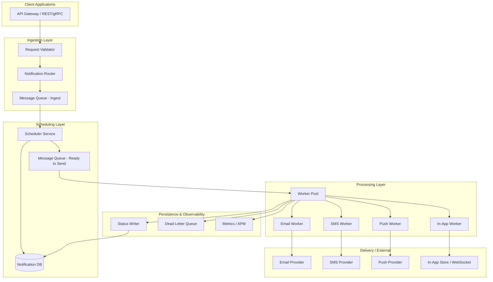

# Notification Service — System Design

**Scenario:** A notification service that sends notifications via multiple channels (email, SMS, push, in-app), handles 100K+ notifications/day, supports scheduled send, tracks delivery status with retries, and must scale to 1M+ notifications/day within 6 months.

---

## A. Architecture Design

### A.1 High-Level System Diagram




---

### A.2 Key Components and Responsibilities


| Component                              | Responsibility                                                                                                                                                                          |
| -------------------------------------- | --------------------------------------------------------------------------------------------------------------------------------------------------------------------------------------- |
| **API Gateway**                        | Auth, rate limiting, request validation, idempotency keys. Exposes `POST /notifications`, `GET /notifications/:id`, webhooks for status.                                                |
| **Request Validator**                  | Validates payload (recipient, channel, template, schedule). Rejects invalid requests before enqueue.                                                                                    |
| **Notification Router**                | Determines channel(s), template, and priority. Writes to ingest queue and persists minimal record in DB for idempotency and lookup.                                                     |
| **Ingest Queue**                       | Buffers incoming notifications. Decouples API from processing. Enables backpressure and replay.                                                                                         |
| **Scheduler Service**                  | Consumes ingest queue; for “send now” enqueues to “ready” queue; for “send at” writes to DB and uses a time-based trigger (cron/scheduled jobs or queue delay) to enqueue at send time. |
| **Ready-to-Send Queue**                | Per-channel or priority queues. Workers pull and send; supports retries and DLQ.                                                                                                        |
| **Workers (Email, SMS, Push, In-App)** | Call external providers or in-app delivery; update delivery status; publish metrics; push failures to retry queue or DLQ.                                                               |
| **Status Writer**                      | Writes delivery status (pending, sent, delivered, failed, bounced) to DB and optionally notifies clients via webhooks.                                                                  |
| **Dead Letter Queue (DLQ)**            | Stores permanently failed or max-retry-exceeded notifications for inspection and manual replay.                                                                                         |


---

### A.3 Database Schema Design

**Option: SQL (recommended for core notification metadata and reporting).**

```sql
-- Core notification request (one row per logical notification)
CREATE TABLE notifications (
    id              UUID PRIMARY KEY DEFAULT gen_random_uuid(),
    idempotency_key VARCHAR(255) UNIQUE NOT NULL,
    tenant_id       VARCHAR(64) NOT NULL,
    user_id         VARCHAR(64) NOT NULL,
    channel         VARCHAR(32) NOT NULL,  -- email, sms, push, in_app
    template_id     VARCHAR(64) NOT NULL,
    payload         JSONB,                 -- template variables, deep links, etc.
    status          VARCHAR(32) NOT NULL DEFAULT 'pending',  -- pending, scheduled, sent, delivered, failed, cancelled
    scheduled_at    TIMESTAMPTZ,           -- NULL = send now
    created_at      TIMESTAMPTZ NOT NULL DEFAULT now(),
    updated_at      TIMESTAMPTZ NOT NULL DEFAULT now()
);
CREATE INDEX idx_notifications_tenant_created ON notifications (tenant_id, created_at);
CREATE INDEX idx_notifications_scheduled ON notifications (scheduled_at) WHERE status = 'scheduled';
CREATE INDEX idx_notifications_status ON notifications (status, created_at);

-- Delivery attempts and provider response (one row per attempt per notification)
CREATE TABLE delivery_attempts (
    id              BIGSERIAL PRIMARY KEY,
    notification_id UUID NOT NULL REFERENCES notifications(id),
    attempt_number  INT NOT NULL,
    provider        VARCHAR(64) NOT NULL,   -- sendgrid, twilio, fcm, etc.
    provider_id     VARCHAR(255),           -- external message id
    status          VARCHAR(32) NOT NULL,   -- sent, delivered, failed, bounced
    status_detail   TEXT,                   -- error message or provider code
    sent_at         TIMESTAMPTZ NOT NULL DEFAULT now(),
    UNIQUE (notification_id, attempt_number)
);

-- User channel preferences and tokens (for push, in-app)
CREATE TABLE user_channels (
    user_id    VARCHAR(64) NOT NULL,
    channel    VARCHAR(32) NOT NULL,
    address    VARCHAR(512) NOT NULL,       -- email, phone, device token, etc.
    verified   BOOLEAN DEFAULT false,
    updated_at TIMESTAMPTZ NOT NULL DEFAULT now(),
    PRIMARY KEY (user_id, channel)
);
```

**Optional: NoSQL (e.g. Cassandra/DynamoDB) for high-volume event log.**

- Use for: delivery events, click/open events, audit log.
- Key design: partition by `(tenant_id, date)` or `(notification_id)`; sort key = `event_time` or `attempt_id`.
- Keeps hot tables small and supports 1M+ writes/day with horizontal scaling.

---

### A.4 Technology Stack Recommendations


| Layer             | Technology           | Justification                                                                                                                           |
| ----------------- | -------------------- | --------------------------------------------------------------------------------------------------------------------------------------- |
| **API**           | Node.js (Fastify)    | High throughput, strong ecosystem for queues and HTTP, quick to iterate for notification payloads and webhooks.                         |
| **Message queue** | RabbitMQ             | Flexible routing, native DLQ and delay, good for 100K–1M/day; at-least-once delivery and backpressure without vendor lock-in.           |
| **Scheduling**    | Redis (sorted sets)  | Lightweight “send at” via score = timestamp; low latency and simple to scale for scheduled notification triggers.                       |
| **Database**      | PostgreSQL           | Strong consistency for notification metadata, status, and idempotency; JSONB for payload; good indexing and reporting.                  |
| **Email**         | Postmark             | Strong deliverability, templates, and bounce handling; simple API and good fit for transactional email.                                 |
| **SMS**           | Vonage               | Reliable global coverage and delivery receipts; well-documented API for high-volume SMS.                                                |
| **Push**          | FCM and APNs         | Standard protocols for Android (FCM) and Apple (APNs); required for native mobile push.                                                 |
| **In-app**        | Socket.io            | Real-time in-app delivery over WebSockets; self-hosted option and easy integration with existing Node.js API.                           |
| **Observability** | Prometheus + Grafana | Metrics for throughput, latency, error rate, and queue depth; alerts on DLQ growth and provider errors; open source and widely adopted. |


---

### A.5 Reliability: Retries, DLQ, and Failure Handling

1. **Retries**
  - **Exponential backoff:** 1 min → 2 min → 4 min (cap e.g. 1 hour). Max attempts per notification (e.g. 3–5).
  - **Implementation:** Worker fails → re-enqueue with `attempt_count` and `next_retry_at`; consumer skips until `next_retry_at`. Alternatively use queue visibility timeout (SQS) or delay queues.
  - **Idempotency:** Use `idempotency_key` or `notification_id + attempt_number` so duplicate processing does not double-send.
2. **Dead Letter Queue (DLQ)**
  - After max retries, move message to DLQ (separate queue or table). Preserve full payload and error reason.
  - Monitor DLQ depth; alert if it grows. Optional: admin UI to inspect, fix (e.g. wrong address), and replay.
3. **At-least-once delivery**
  - Queue is the source of truth for “to be sent.” Workers ack only after successful send and status write. On worker crash, message becomes visible again and is retried.
4. **Circuit breaker**
  - If a provider (e.g. email or SMS gateway) is down or returning 5xx, open circuit after N failures; stop sending to that provider for a short window; route to DLQ or retry queue instead of hammering the provider.
5. **Idempotency**
  - API: `Idempotency-Key` header → one row in `notifications` per key; duplicate requests return same `notification_id` and status.
  - Workers: provider idempotency (e.g. same `external_id`) or internal idempotency so duplicate consumes do not send twice.

---

## B. Scalability & Performance

### B.1 Scaling from 100K to 1M+ Notifications per Day


| Lever                  | Approach                                                                                                                                                                                           |
| ---------------------- | -------------------------------------------------------------------------------------------------------------------------------------------------------------------------------------------------- |
| **Workers**            | Add more worker instances (horizontal scaling). 100K/day ≈ 1.2/sec average; 1M/day ≈ 12/sec. One worker can handle hundreds of notifications/sec per channel; scale worker count with queue depth. |
| **Queue partitioning** | Partition by channel (email, sms, push, in_app) or by tenant. Each partition can be scaled independently and avoids head-of-line blocking.                                                         |
| **Database**           | Read replicas for status and history reads; primary for writes. Indexes on `tenant_id`, `created_at`, `scheduled_at`, `status`. Archive old data to cold storage (e.g. S3) to keep tables small.   |
| **Scheduler**          | Shard by time bucket or tenant. Multiple scheduler instances each handling a subset of `scheduled_at`; use DB locks or distributed lock (Redis) to avoid double-enqueue.                           |
| **Caching**            | Cache user channel addresses and template content in Redis to reduce DB and provider latency.                                                                                                      |
| **Provider limits**    | Use multiple provider accounts or API keys and round-robin or least-loaded to avoid single-account rate limits.                                                                                    |


Target: **1M/day ≈ 12 notifications/sec average**. With 10× burst headroom, design for ~120–200/sec. A small worker fleet (e.g. 5–10 per channel) plus a scalable queue and DB can achieve this.

---

### B.2 Handling Traffic Spikes (e.g. 50K in 5 Minutes)

- **Queue as buffer:** Ingest all 50K into the ingest queue quickly. API responds with 202 and `notification_id`; actual send happens asynchronously. Queue absorbs the spike.
- **Auto-scaling workers:** Scale worker count based on queue depth or message age (e.g. CloudWatch + SQS depth). As depth grows, add workers; scale down when depth is low.
- **Rate limiting at provider:** Respect each provider’s rate limits (e.g. per-second caps). Use an internal rate limiter (token bucket or sliding window) per provider so workers don’t exceed limits and get throttled.
- **Priority queues:** Optional: high-priority queue for transactional (password reset) vs bulk (marketing). During spikes, process high-priority first so critical notifications are not delayed.
- **SLA communication:** Define and document “best effort within N minutes” for non-critical traffic so product and support know what to expect during spikes.

---

### B.3 High Availability and Fault Tolerance


| Mechanism                        | Implementation                                                                                                                         |
| -------------------------------- | -------------------------------------------------------------------------------------------------------------------------------------- |
| **Multi-AZ / multi-region**      | Run API, workers, and queue in at least 2 AZs. DB with synchronous replica in another AZ; failover via RDS Multi-AZ or equivalent.     |
| **Stateless services**           | API and workers keep no local state; all state in DB and queue. Any instance can serve any request.                                    |
| **Queue durability**             | Use a durable queue (SQS, RabbitMQ with persistence, Kafka). Messages survive broker restarts.                                         |
| **Graceful shutdown**            | Workers finish in-flight message, then stop accepting new ones; use heartbeat/visibility timeout so messages are not lost on shutdown. |
| **Health checks**                | Liveness: process up. Readiness: DB and queue reachable. Load balancer stops sending traffic to unhealthy instances.                   |
| **Database**                     | Automated backups, point-in-time recovery. Replicas for read scaling and failover.                                                     |
| **Circuit breakers & fallbacks** | Per-provider circuit breaker; optional fallback channel (e.g. email if SMS fails) for critical notifications.                          |


---

## C. Trade-offs

### C.1 In-House vs Third-Party (Managed Notification Providers)


| Dimension          | In-house                                                                                                                                                                                                                                                                                                                                                                                 | Third-party (managed email/SMS/push providers)                              |
| ------------------ | ---------------------------------------------------------------------------------------------------------------------------------------------------------------------------------------------------------------------------------------------------------------------------------------------------------------------------------------------------------------------------------------- | --------------------------------------------------------------------------- |
| **Cost**           | Higher initial and ongoing eng (devops, scaling, deliverability). Lower marginal cost at very high volume.                                                                                                                                                                                                                                                                               | Lower fixed cost; pay per message. Can become expensive at 1M+/day.         |
| **Control**        | Full control over retries, queues, routing, and data residency.                                                                                                                                                                                                                                                                                                                          | Limited to provider APIs and SLAs; less control over infra.                 |
| **Deliverability** | You own IP reputation, bounce handling, and compliance (CAN-SPAM, GDPR). Harder for email.                                                                                                                                                                                                                                                                                               | Providers manage reputation and compliance; usually better inbox placement. |
| **Time to market** | Slower: build queues, workers, scheduling, monitoring.                                                                                                                                                                                                                                                                                                                                   | Faster: integrate APIs, focus on product and templates.                     |
| **Recommendation** | **Hybrid:** Build **in-house** the orchestration layer (API, queue, scheduler, status, retries, DLQ, multi-channel routing). Use **third-party** for actual delivery (managed email/SMS providers, FCM/APNs for push). You get control and resilience without owning SMTP stacks or carrier relationships. Full in-house only if volume is huge and cost dominates (e.g. billions/year). |                                                                             |


---

### C.2 SQL vs NoSQL for This Use Case


| Aspect          | SQL (e.g. PostgreSQL)                                                                                                                                                                                                                                                              | NoSQL (e.g. Cassandra, DynamoDB)                                                    |
| --------------- | ---------------------------------------------------------------------------------------------------------------------------------------------------------------------------------------------------------------------------------------------------------------------------------- | ----------------------------------------------------------------------------------- |
| **Schema**      | Fixed schema for notifications and attempts; JSONB for flexible payload.                                                                                                                                                                                                           | Flexible schema; good for event log and varying attributes.                         |
| **Consistency** | Strong consistency for idempotency, status updates, and reporting.                                                                                                                                                                                                                 | Eventually consistent by default; optional strong consistency where supported.      |
| **Queries**     | Rich queries: by user, tenant, date range, status, scheduled_at. Joins for attempts and reporting.                                                                                                                                                                                 | Key/partition access and range scans within partition. Avoid cross-partition joins. |
| **Scaling**     | Vertical + read replicas; sharding possible but more complex.                                                                                                                                                                                                                      | Horizontal scaling by partition key; good for very high write throughput.           |
| **Use here**    | **SQL for core:** `notifications`, `delivery_attempts`, `user_channels`. Best for correctness, reporting, and operational queries. **NoSQL optional:** high-volume event log (opens, clicks) or audit trail where eventual consistency and partition-based scaling are acceptable. |                                                                                     |


**Recommendation:** Primary store = **SQL**. Add **NoSQL** only for append-only, high-volume event data if needed for analytics or compliance.

---

### C.3 Synchronous vs Asynchronous Processing


| Approach         | Pros                                                                                                                                           | Cons                                                                                                                                            |
| ---------------- | ---------------------------------------------------------------------------------------------------------------------------------------------- | ----------------------------------------------------------------------------------------------------------------------------------------------- |
| **Synchronous**  | Simple: API calls provider and returns success/failure. Client gets immediate feedback.                                                        | API latency = provider latency (slow or flaky providers block clients). No natural retry; harder to handle 50K in 5 minutes. Poor scalability.  |
| **Asynchronous** | API returns quickly (202 + id). Queue absorbs load; workers retry and use DLQ. Scales with worker count. Handles spikes and provider slowness. | Client does not get “delivered” in the same request; need polling or webhooks for status. Slightly more complex (queues, workers, idempotency). |


**Recommendation:** **Asynchronous** for almost all notifications. Use a single queue (or per-channel queues) and workers; API enqueues and returns `notification_id` and optional `status` URL. For rare “send and wait” flows (e.g. OTP and immediate check), offer a separate synchronous endpoint with short timeout and limited concurrency, or keep OTP in async with short SLA and client polling.

---

